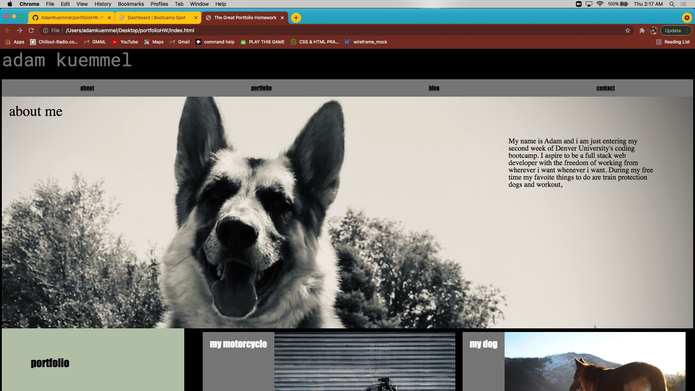

# portfolioHW

In this home work we created a portfolio webpage to showcase the work we have created to present to an employer.

I implemented multiple different styling and positioning elements to create a web page that satisfied all the acceptance criteria.

I did not have anything to put into my portfolio, so i chose things that i liked about myself and used pictures and links that correspond with said things.

# screenshot of work

# deployable link to work

https://adamkuemmel.github.io/portfolioHW/
cinn
